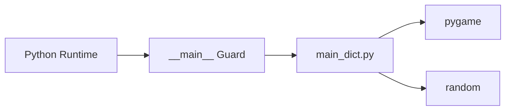
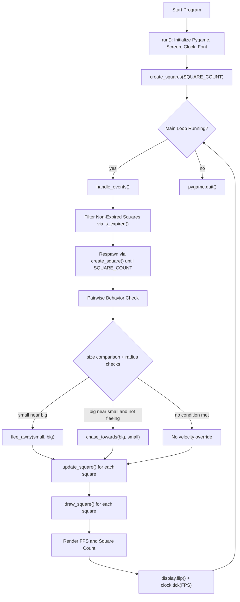
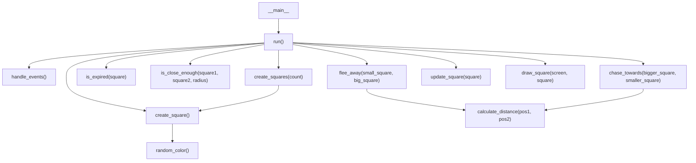
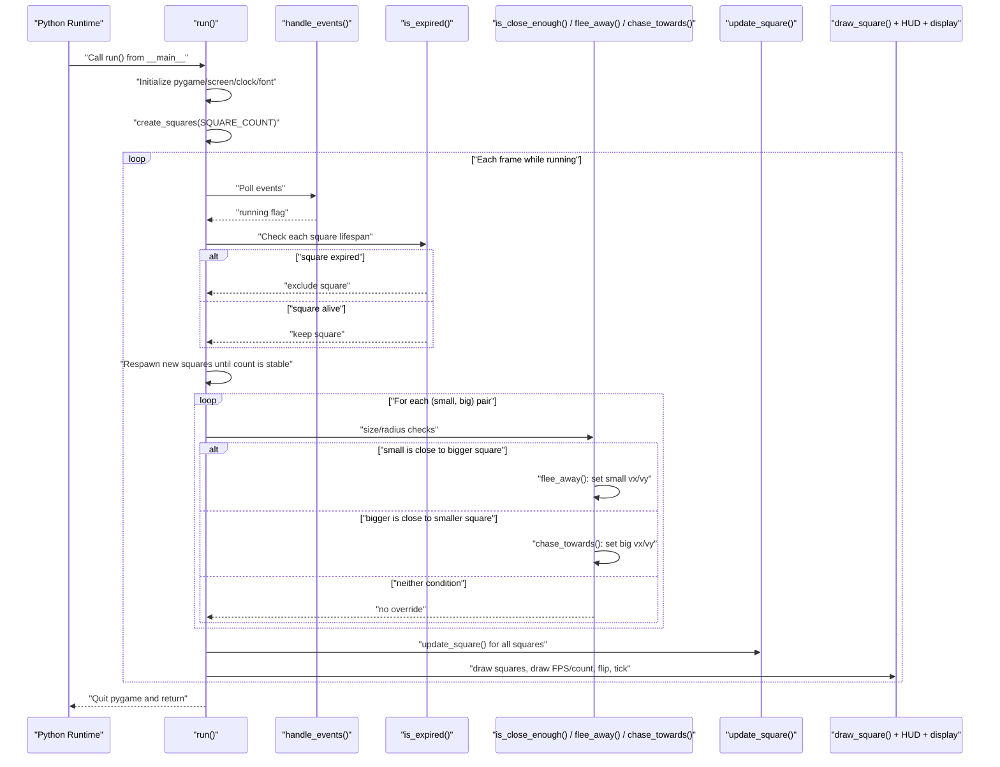

# Architecture Documentation

This document describes the architecture of the current project implementation in `main_dict.py`.

## Scope and assumptions

- The runtime is a single-module Pygame application.
- The primary execution path is `run()` (invoked from `if __name__ == "__main__":`).
- Behavioral logic includes lifespan filtering, flee behavior, chase behavior, movement updates, and rendering.

## Module dependency graph

## High-level runtime flow

## Function-level call graph

## Primary execution sequence (full frame path)

## Data model snapshot

The application uses plain dictionaries for entities. A square contains:

- Position: `x`, `y`
- Velocity: `vx`, `vy`
- Visual state: `size`, `color`
- Lifecycle state: `created_at`, `lifespan`

This dictionary is read and mutated by multiple functions (`is_expired`, movement and behavior functions, and rendering).
